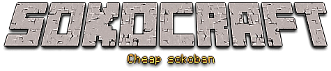

<!-- Improved compatibility of back to top link: See: https://github.com/othneildrew/Best-README-Template/pull/73 -->
<a name="readme-top"></a>
<!--
*** Thanks for checking out the Best-README-Template. If you have a suggestion
*** that would make this better, please fork the repo and create a pull request
*** or simply open an issue with the tag "enhancement".
*** Don't forget to give the project a star!
*** Thanks again! Now go create something AMAZING! :D
-->


<!-- PROJECT SHIELDS -->
<!--
*** I'm using markdown "reference style" links for readability.
*** Reference links are enclosed in brackets [ ] instead of parentheses ( ).
*** See the bottom of this document for the declaration of the reference variables
*** for contributors-url, forks-url, etc. This is an optional, concise syntax you may use.
*** https://www.markdownguide.org/basic-syntax/#reference-style-links
-->
[![Contributors][contributors-shield]][contributors-url]
[![Forks][forks-shield]][forks-url]
[![Stargazers][stars-shield]][stars-url]
[![Issues][issues-shield]][issues-url]
[![MIT License][license-shield]][license-url]


<!-- PROJECT LOGO -->
<br />
<div align="center">
  <a href="https://github.com/github_username/repo_name">
    
  </a>

<h3 align="center">Sokocraft</h3>

  <p align="center">
    A litle sokoban made in C#
    <br />
    <a href="https://github.com/sepradc/sokocraft"><strong>Explore the docs »</strong></a>
    <br />
    <br />
    <a href="https://github.com/sepradc/sokocraft">View Demo</a>
    ·
    <a href="https://github.com/sepradc/sokocraft/issues">Report Bug</a>
    ·
    <a href="https://github.com/sepradc/sokocraft/issues">Request Feature</a>
  </p>
</div>


<!-- TABLE OF CONTENTS -->
<details>
  <summary>Table of Contents</summary>
  <ol>
    <li>
      <a href="#about-the-project">About The Project</a>
      <ul>
        <li><a href="#built-with">Built With</a></li>
      </ul>
    </li>
    <li>
      <a href="#getting-started">Getting Started</a>
      <ul>
        <li><a href="#prerequisites">Prerequisites</a></li>
        <li><a href="#installation">Installation</a></li>
      </ul>
    </li>
    <li><a href="#usage">Usage</a></li>
    <li><a href="#roadmap">Roadmap</a></li>
    <li><a href="#contributing">Contributing</a></li>
    <li><a href="#license">License</a></li>
    <li><a href="#contact">Contact</a></li>
  </ol>
</details>


<!-- ABOUT THE PROJECT -->
## About The Project

[![Product Name Screen Shot][product-screenshot]](https://example.com)

Sokocraft is a project made at school to learn C# and WPF. It's a cover of the real game Sokoban with Minecraft textures.

<p align="right">(<a href="#readme-top">back to top</a>)</p>


### Built With

* [![.NETcore][.NETcore]][.NETcore-url]

<p align="right">(<a href="#readme-top">back to top</a>)</p>


<!-- GETTING STARTED -->
## Getting Started

This project was build with .NET core and wpf. Before dev you need to validate prerequisites 

### Prerequisites

The project was developed with .NET core 3.1.
* Download .NET core :
  https://dotnet.microsoft.com/en-us/download/dotnet/3.1

* Windows OS
### Installation

1.  Clone the repo
   ```sh
   git clone https://github.com/sepradc/sokocraft.git
   ```

### Run project

1. Running the app
   ```sh
   dotnet run
   ```
2. Build the app
   ```sh
   dotnet build
   ```

<p align="right">(<a href="#readme-top">back to top</a>)</p>


<!-- USAGE EXAMPLES -->
## Usage

### Create new map
The project was designed to create your own map with **.txt** files the pattern is quite simple.

1. Create a file with this name in right directory
   ```txt
   fields/level{number}.txt
   ```
   
2. Make a 10x10 pattern with dot inside file
   ```txt
   ..........
   ..........
   ..........
   ..........
   ..........
   ..........
   ..........
   ..........
   ..........
   ..........
   ```
3. To create the walls, crates, target and player change you need to change dot with the right letter
   - **X** for walls
   - **C** for crates
   - **o** for target
   - **P** for initial player position
   ```txt
   XXXXXXXXXX
   X........X
   X......P.X
   X........X
   X......C.X
   X........X
   XXXXX....X
   X.o......X
   X........X
   XXXXXXXXXX
   ```

<p align="right">(<a href="#readme-top">back to top</a>)</p>


<!-- ROADMAP -->
## Roadmap

- [ ] New blocks ans mechanics
- [ ] Highscore
- [ ] Helper to create new maps

See the [open issues](https://github.com/sepradc/sokocraft/issues) for a full list of proposed features (and known issues).

<p align="right">(<a href="#readme-top">back to top</a>)</p>


<!-- CONTRIBUTING -->
## Contributing

Contributions are what make the open source community such an amazing place to learn, inspire, and create. Any contributions you make are **greatly appreciated**.

If you have a suggestion that would make this better, please fork the repo and create a pull request. You can also simply open an issue with the tag "enhancement".
Don't forget to give the project a star! Thanks again!

1. Fork the Project
2. Create your Feature Branch (`git checkout -b feature/AmazingFeature`)
3. Commit your Changes (`git commit -m 'Add some AmazingFeature'`)
4. Push to the Branch (`git push origin feature/AmazingFeature`)
5. Open a Pull Request

<p align="right">(<a href="#readme-top">back to top</a>)</p>


<!-- LICENSE -->
## License

Distributed under the MIT License. See `LICENSE.txt` for more information.

<p align="right">(<a href="#readme-top">back to top</a>)</p>

<!-- CONTACT -->
## Contact

SepraDC - [@sepradc](https://twitter.com/sepradc)

Project Link: [https://github.com/sepradc/sokocraft](https://github.com/sepradc/sokocraft)


<p align="right">(<a href="#readme-top">back to top</a>)</p>


<!-- MARKDOWN LINKS & IMAGES -->
<!-- https://www.markdownguide.org/basic-syntax/#reference-style-links -->
[contributors-shield]: https://img.shields.io/github/contributors/sepradc/sokocraft.svg?style=for-the-badge
[contributors-url]: https://github.com/sepradc/sokocraft/graphs/contributors
[forks-shield]: https://img.shields.io/github/forks/sepradc/sokocraft.svg?style=for-the-badge
[forks-url]: https://github.com/sepradc/sokocraft/network/members
[stars-shield]: https://img.shields.io/github/stars/sepradc/sokocraft.svg?style=for-the-badge
[stars-url]: https://github.com/sepradc/sokocraft/stargazers
[issues-shield]: https://img.shields.io/github/issues/sepradc/sokocraft.svg?style=for-the-badge
[issues-url]: https://github.com/sepradc/sokocraft/issues
[license-shield]: https://img.shields.io/github/license/sepradc/sokocraft.svg?style=for-the-badge
[license-url]: https://github.com/sepradc/sokocraft/blob/master/LICENSE.txt
[product-screenshot]: ./images/screenshot.png
[.NETcore]: https://img.shields.io/badge/.NETcore-000000?style=for-the-badge&logo=csharp&logoColor=white
[.NETcore-url]: https://learn.microsoft.com/fr-fr/dotnet/core/introduction
